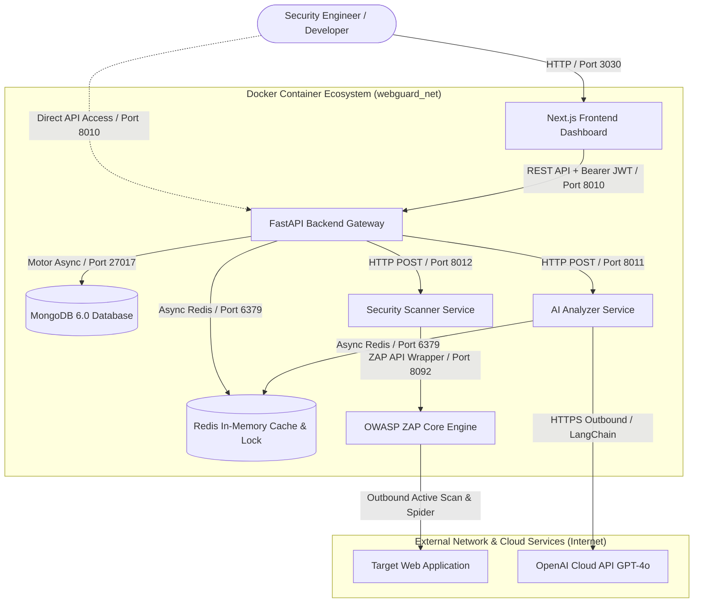
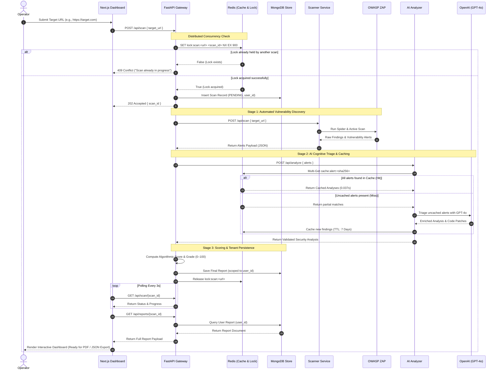

# 🛡️ WebGuard AI

### *Intelligent Dynamic Application Security Testing (DAST) Platform*

[](LICENSE)
[](https://www.python.org/)
[](https://fastapi.tiangolo.com/)
[](https://nextjs.org/)
[](https://www.docker.com/)
[](https://redis.io/)
[](https://www.zaproxy.org/)
[](https://www.langchain.com/)
[](https://openai.com/)
[](https://www.mongodb.com/)

---

## 📌 Overview

**WebGuard AI** is an enterprise-grade, high-performance Dynamic Application Security Testing (DAST) platform that bridges the gap between raw automated vulnerability discovery and rapid developer remediation.

Traditional vulnerability scanners flood engineering teams with noisy, low-level technical reports burdened by false positives, repetitive jargon, and generic advice. WebGuard AI introduces an **Intelligent Multi-Tier Architecture**:

1. **Deterministic Security Engine (OWASP ZAP):** Executes automated web crawling and active payload testing against web targets according to the **OWASP Top 10** vulnerabilities.
2. **Cognitive Analysis Layer (LangChain + OpenAI GPT-4o):** Triages discovered alerts, validates findings against context, eliminates false positives, and generates ready-to-deploy remediation code patches in plain developer language.
3. **High-Performance Distributed Cache & Lock Layer (Redis):** Accelerates repeated vulnerability analysis by up to **335x**, enforces atomic distributed scan locks to eliminate redundant scanning workloads, and provides synchronized rate limiting across container replicas.

The result is an automated, developer-first security posture assessment featuring an algorithmic **Security Score (0–100)**, interactive risk heatmaps, executive reporting, and actionable fix guides.

---

## 🚀 Key Improvements & Performance Metrics

Through our distributed architecture upgrade (incorporating Redis in-memory storage, deterministic SHA-256 caching, atomic distributed locks, and synchronized rate limiting), WebGuard AI achieves industry-leading benchmarks:

### 📈 Benchmark Comparison

| Metric / Operation | Without Optimization (Legacy) | With WebGuard AI Distributed Layer | Performance Gain / Impact |
| :--- | :---: | :---: | :---: |
| **Repeated Vulnerability Analysis** | `12.4s` (OpenAI API call) | **`0.037s` (37ms)** (Redis Cache Hit) | ⚡ **99.7% Latency Reduction (335x Speedup)** |
| **OpenAI LLM Token Consumption** | ~1,850 tokens / batch | **0 tokens** (Cached findings) | 💰 **100% Cost Elimination on Cache Hit** |
| **CI/CD Regression Scan Token Savings** | High recurring API cost | **70% – 85% typical savings** | 📉 **~80% Average Cost Reduction** |
| **Concurrent Duplicate Scan Attempts** | Duplicate scans queued / wasted resources | **Instant `HTTP 409 Conflict` (0ms delay)** | 🛑 **100% Elimination of Redundant Scans** |
| **Vulnerability Cache Validity (TTL)** | None (re-queried every scan) | **7 Days (604,800 seconds)** | ⏳ **Predictable, Long-Lived Cache Freshness** |
| **Authentication Rate Limiting** | Per-instance (bypassed via replicas) | **Globally Synchronized (Redis backend)** | 🔒 **100% Brute-Force Coverage Across Replicas** |
| **Distributed Lock Acquisition Time** | N/A (In-memory locks) | **< 1.5ms (Atomic `SET NX EX`)** | ⚡ **Sub-millisecond Concurrency Control** |

### 🔍 Architectural Highlights
- **Deterministic SHA-256 Alert Hashing:** Unique fingerprinting based on normalized alert name and technical description ensures cache hits regardless of scanning order or target URL.
- **Atomic Concurrency Protection:** Distributed locking prevents race conditions and shields ZAP scanner instances from CPU and network exhaustion caused by rapid duplicate submissions.
- **Fail-Safe Graceful Degradation:** Both the AI analyzer and the API gateway automatically fall back to live execution and in-memory rate limiting if Redis is temporarily unreachable.

---

## ✨ Key Features

<table>
  <tbody>
    <tr>
      <td valign="top" width="35">⚡</td>
      <td><strong>Automated DAST Discovery Pipeline:</strong> Crawls web targets with an automated Spider and initiates active payload scans via an isolated OWASP ZAP daemon.</td>
    </tr>
    <tr>
      <td valign="top" width="35">🧠</td>
      <td><strong>AI-Powered Alert Triaging:</strong> Evaluates discovered alerts to filter false positives and surface high-confidence vulnerabilities.</td>
    </tr>
    <tr>
      <td valign="top" width="35">⚡</td>
      <td><strong>Application-Level AI Response Caching:</strong> Uses Redis and SHA-256 fingerprints to cache LLM analyses for 7 days, slashing response times from 12s to 37ms (99.7% faster).</td>
    </tr>
    <tr>
      <td valign="top" width="35">🔒</td>
      <td><strong>Distributed Scan Locking:</strong> Prevents duplicate concurrent scans on the same target URL across multi-container deployments, returning an immediate <code>HTTP 409 Conflict</code>.</td>
    </tr>
    <tr>
      <td valign="top" width="35">🛡️</td>
      <td><strong>Synchronized Distributed Rate Limiting:</strong> Protects authentication endpoints (<code>/login</code> and <code>/register</code>) against brute-force attacks across all backend replicas via Redis.</td>
    </tr>
    <tr>
      <td valign="top" width="35">🛠️</td>
      <td><strong>Actionable Code Remediation:</strong> Delivers tailored code solutions (Python, Node.js, PHP, React, etc.) and configuration hardening guides directly inside each vulnerability card.</td>
    </tr>
    <tr>
      <td valign="top" width="35">📊</td>
      <td><strong>Algorithmic Security Scoring:</strong> Calculates an objective security grade (<code>A+</code> to <code>F</code>) based on weighted risk impacts, displayed on an interactive visual gauge.</td>
    </tr>
    <tr>
      <td valign="top" width="35">🖨️</td>
      <td><strong>Executive Report Exporting (PDF & JSON):</strong> One-click high-fidelity PDF export featuring an automated print-optimized stylesheet, alongside machine-readable full JSON downloads for compliance and security audit trails.</td>
    </tr>
    <tr>
      <td valign="top" width="35">📜</td>
      <td><strong>Centralized Reports History (<code>/reports</code>):</strong> Comprehensive scan archive allowing security engineers to review past assessments, track vulnerability posture over time, and inspect or purge historical records.</td>
    </tr>
    <tr>
      <td valign="top" width="35">🔍</td>
      <td><strong>Deep-Linked Report Inspection:</strong> Direct route loading (<code>/?report_id=...</code>) to revisit and analyze any historical assessment in the full interactive Dashboard.</td>
    </tr>
    <tr>
      <td valign="top" width="35">🖥️</td>
      <td><strong>Modern Next.js Dashboard:</strong> Built with Next.js 16 and React 19, featuring live progress polling, risk charts, quick filtering, hot-reloading development support, and responsive dark-mode styling.</td>
    </tr>
    <tr>
      <td valign="top" width="35">🛡️</td>
      <td><strong>Multi-Tenant User Data Isolation:</strong> Enforces strict Broken Object Level Authorization (BOLA/IDOR) controls so security operators can only access, view, and delete their own vulnerability assessments.</td>
    </tr>
  </tbody>
</table>

---

## 🏛️ System Architecture

WebGuard AI operates as a containerized microservices ecosystem consisting of **7 specialized services** managed by Docker Compose.



### 📦 Microservices Specifications

| Container Name | Service Role | Stack | Host Port | Internal Port | Description |
| :--- | :--- | :--- | :---: | :---: | :--- |
| `webguard-frontend` | **User Interface** | Next.js 16, React 19, Tailwind CSS | `3030` | `3030` | Modern responsive web UI & interactive security dashboard |
| `webguard-backend` | **Central Gateway** | FastAPI, Python 3.10, Motor, Slowapi | `8010` | `8010` | Auth, distributed locking, rate limiting, scoring, & DB CRUD |
| `webguard-redis` | **In-Memory Cache & Lock** | Redis 7 (Alpine) | `6399` | `6379` | Fast distributed caching, scan locks, and rate limit counters |
| `webguard-scanner-api` | **Scanner Bridge** | FastAPI, Python 3.10, `zapv2` | `8012` | `8012` | Target validation, Spider crawl coordination, and Active Scans |
| `webguard-zap-engine` | **Core DAST Engine** | OWASP ZAP Stable Daemon | `8092` | `8092` | Automated web crawler and active security vulnerability scanner |
| `webguard-ai-api` | **Cognitive Analyzer**| FastAPI, LangChain, OpenAI, Redis | `8011` | `8011` | False-positive triaging, remediation patches, & response caching |
| `webguard-mongodb` | **Persistent Store** | MongoDB 6.0 | `27017` | `27017` | Document store for users, active scans, and security reports |

---

## 🔄 End-to-End Scan Pipeline



---

## 🧮 Security Scoring Methodology

WebGuard AI assesses the target application's security posture using a deterministic algorithmic scoring model:

$$Score = \max\left(0, 100 - \sum (\text{Vulnerability Count} \times \text{Weight})\right)$$

### ⚖️ Risk Penalty Weights

| Vulnerability Severity | Impact Weight | Rationale |
| :--- | :---: | :--- |
| **High** | `-15 pts` | Critical risks (e.g., SQLi, RCE, Broken Auth) that can lead to total compromise. |
| **Medium** | `-8 pts` | Significant flaws (e.g., Stored XSS, CSRF, sensitive header disclosure). |
| **Low** | `-3 pts` | Configuration weaknesses, missing clickjacking protections, or info leaks. |
| **Informational** | `-1 pt` | Low-impact observations, timestamp disclosures, or header suggestions. |

### 📊 Posture Grade Scale

| Score Range | Grade | Posture Badge | Definition |
| :---: | :---: | :---: | :--- |
| **95 – 100** | `A+` | 🟢 Excellent | Fully hardened application; no significant vulnerabilities detected. |
| **85 – 94** | `A` | 🟢 Very Good | Robust posture with only minor informational findings. |
| **70 – 84** | `B` | 🟡 Good | Acceptable posture; requires moderate hardening. |
| **50 – 69** | `C` | 🟠 Average | Elevated risk; vulnerabilities must be scheduled for remediation. |
| **30 – 49** | `D` | 🔴 Poor | High-risk posture with multiple severe vulnerabilities. |
| **0 – 29** | `F` | 🚨 Critical | Severe compromise risk; requires immediate incident intervention. |

---

## 📄 Reporting, Exporting & Audit History

WebGuard AI provides enterprise-grade reporting workflows to bridge security engineering with executive and compliance teams:

<table>
  <tbody>
    <tr>
      <td valign="top" width="35">🖨️</td>
      <td><strong>One-Click PDF Export:</strong> Directly from the scan dashboard, click <strong>"Export PDF"</strong> to generate a clean, print-ready document. The custom <code>@media print</code> CSS engine automatically converts the dark UI into an executive, high-contrast white layout while omitting interactive buttons and preserving security gauges, charts, and remediation directives.</td>
    </tr>
    <tr>
      <td valign="top" width="35">💾</td>
      <td><strong>Machine-Readable JSON Downloads:</strong> Export full vulnerability payloads—including verified findings, false-positive metrics, severity ratings, and AI-generated remediation patches—for automated ingestion into SIEMs, defect trackers (Jira/GitHub), or compliance archives.</td>
    </tr>
    <tr>
      <td valign="top" width="35">📜</td>
      <td><strong>Centralized Reports Hub (<code>/reports</code>):</strong> A dedicated interface to review, search, deep-link, and purge historical assessments stored in MongoDB.</td>
    </tr>
    <tr>
      <td valign="top" width="35">🔍</td>
      <td><strong>Instant Historical Inspection:</strong> Re-open any past scan into the live dashboard with a single click (<code>👁️ View</code>) or via direct URL parameter (<code>/?report_id=...</code>).</td>
    </tr>
  </tbody>
</table>

---

## 🛠️ Tech Stack

- **Frontend:** Next.js 16 (Pages Router & Turbopack), React 19, Tailwind CSS, Recharts, Lucide Icons.
- **Backend Services:** FastAPI, Python 3.10, Pydantic v2, Motor (Async MongoDB), Redis asyncio (`redis>=5.0.0`), Slowapi, PyJWT, Passlib (bcrypt).
- **In-Memory Cache & Locks:** Redis 7.0 (Alpine) with health monitoring and automatic reconnect.
- **Scanner Engine:** OWASP ZAP (Zed Attack Proxy) 2.14+, `zapv2` Python Client.
- **AI & Intelligence:** LangChain, OpenAI API (configurable via `OPENAI_MODEL`, supporting `gpt-4o` / `gpt-4o-mini`), Structured JSON Outputs.
- **Persistence & DevOps:** MongoDB 6.0, Docker Compose v2, Linux / WSL2.

---

## ⚙️ Prerequisites

Before getting started, ensure your environment meets the following requirements:

- **Operating System:** Linux, macOS, or Windows 11 with **WSL2** (Ubuntu 22.04 LTS recommended).
- **Docker & Docker Compose:** Docker Engine 24.0+ and Docker Compose v2.20+.
- **OpenAI API Key:** An active key from [platform.openai.com](https://platform.openai.com/api-keys).
- **Hardware Recommendation:** 4 CPU cores, 8 GB RAM (OWASP ZAP requires sufficient memory for Java heap allocation).

---

## 🚀 Quickstart & Installation

### 1. Clone the Repository

```bash
git clone https://github.com/Ammar-1993/WebGuard-AI.git
cd WebGuard-AI
```

### 2. Configure Environment Variables

Create your environment configuration from the provided template:

```bash
cp .env.example .env
```

Open `.env` and fill in your credentials:

```env
# OpenAI API Key (Required for AI Analysis)
OPENAI_API_KEY=sk-proj-your-openai-api-key-here

# Preferred OpenAI Model (Default: gpt-4o | Optional: gpt-4o-mini, gpt-4-turbo)
OPENAI_MODEL=gpt-4o

# Secret Key for JWT Token Generation (Must be at least 32 characters in production)
JWT_SECRET=your-secure-random-jwt-secret-key-at-least-32-chars

# Redis Cache & Lock Connection URL
REDIS_URL=redis://redis:6379/0
```

### 3. Build and Start Microservices

Launch the entire 7-service ecosystem in detached mode:

```bash
docker compose up --build -d
```

Verify all 7 containers are running and healthy:

```bash
docker compose ps
```

Expected output:
```text
NAME                   IMAGE                          STATUS                   PORTS
webguard-redis         redis:alpine                   Up (healthy)             0.0.0.0:6399->6379/tcp
webguard-mongodb       mongo:6.0.10                   Up (healthy)             0.0.0.0:27017->27017/tcp
webguard-zap-engine    zaproxy/zap-stable:latest      Up (healthy)             0.0.0.0:8092->8092/tcp
webguard-scanner-api   webguard-ai-security-scanner   Up                       0.0.0.0:8012->8012/tcp
webguard-ai-api        webguard-ai-ai-analyzer        Up                       0.0.0.0:8011->8011/tcp
webguard-backend       webguard-ai-backend-api        Up                       0.0.0.0:8010->8010/tcp
webguard-frontend      webguard-ai-frontend           Up                       0.0.0.0:3030->3030/tcp
```

### 4. Access the Application

| Portal | URL | Description |
| :--- | :--- | :--- |
| **Web Dashboard** | [http://localhost:3030](http://localhost:3030) | Main scan execution and interactive assessment view |
| **Reports History** | [http://localhost:3030/reports](http://localhost:3030/reports) | Historical scan audit trail, JSON exports, and report management |
| **Backend API Docs** | [http://localhost:8010/docs](http://localhost:8010/docs) | Interactive Swagger UI for core backend gateway |
| **AI Service Docs** | [http://localhost:8011/docs](http://localhost:8011/docs) | AI Analyzer OpenAPI documentation & Cache health |
| **Scanner Service Docs** | [http://localhost:8012/docs](http://localhost:8012/docs) | Scanner OpenAPI documentation |

---

## 📡 REST API Reference

The Backend Gateway provides secure, token-authenticated RESTful endpoints:

### 🔐 Authentication (`/api/auth`)
| Method | Endpoint | Description | Rate Limit | Access Level |
| :---: | :--- | :--- | :---: | :---: |
| `POST` | `/api/auth/register` | Register a new security operator account | `3/hour` | `🌐 Public` |
| `POST` | `/api/auth/login` | Authenticate credentials and receive JWT bearer token | `5/minute` | `🌐 Public` |
| `GET` | `/api/auth/me` | Fetch active authenticated profile details | Unlimited | `🔒 Protected` |

### 🎯 Security Scans (`/api/scan`)
| Method | Endpoint | Description | Status Codes | Access Level |
| :---: | :--- | :--- | :---: | :---: |
| `POST` | `/api/scan` | Trigger a new asynchronous DAST scan pipeline | `202 Accepted`<br/>`409 Conflict` (if running) | `🔒 Protected` |
| `GET` | `/api/scan/{scan_id}` | Poll real-time scan progress, status & findings | `200 OK`<br/>`404 Not Found` | `🔒 Protected` |

### 📑 Security Reports (`/api/reports`)
| Method | Endpoint | Description | Access Level |
| :---: | :--- | :--- | :---: |
| `GET` | `/api/reports` | List all historical reports for active user (sorted descending) | `🔒 Protected` |
| `GET` | `/api/reports/{report_id}` | Fetch granular report details & AI remediation patches | `🔒 Protected` |
| `DELETE` | `/api/reports/{report_id}` | Remove a report and associated scan artifacts | `🔒 Protected` |

> 💡 **User Data Isolation & Concurrency Control:**
> - All protected scan and report endpoints enforce strict Broken Object Level Authorization (BOLA/IDOR protection).
> - Scan submissions are protected by Redis Distributed Locks (`lock:scan:<url>`), returning `HTTP 409 Conflict` if a scan for the target URL is already underway.

---

## 🧪 Safe Targets for Testing & Benchmarking

When testing WebGuard AI in non-production environments, use authorized vulnerable test applications:

- **OWASP Juice Shop:** `http://localhost:3000` (Modern vulnerable JavaScript application)
- **Zero Bank Demo:** `http://zero.webappsecurity.com` (Safe banking test target)
- **Google Gruyere:** `https://google-gruyere.appspot.com` (Web application vulnerabilities lab)
- **Altoro Mutual:** `http://demo.testfire.net` (Simulated corporate banking portal)

> ⚠️ **Authorization Disclaimer:** Only scan applications and infrastructure that you own or have received explicit, written permission to assess. Unauthorized vulnerability scanning may violate legal regulations and terms of service.

---

## 🧯 Troubleshooting & Common Questions

<details>
<summary><strong>1. OWASP ZAP takes longer than expected or times out</strong></summary>

Large web applications with hundreds of routes can take several minutes to spider. By default, `scanner_engine.py` sets a 300-second safeguard timeout on the Active Scan phase. You can adjust this threshold in `security-scanner/scanner_engine.py`.
</details>

<details>
<summary><strong>2. AI Analyzer returns an OpenAI authentication error</strong></summary>

Ensure your `OPENAI_API_KEY` is set correctly in `.env` and has active quota/billing credits. Check container logs using:
```bash
docker compose logs -f ai-analyzer
```
</details>

<details>
<summary><strong>3. Port conflict (e.g., port 3030, 8010, 6399, or 27017 already in use)</strong></summary>

If host ports conflict with existing local services, modify the left-hand host port mapping in `docker-compose.yml` (e.g., change `"6399:6379"` to `"6398:6379"`). Redis internally always communicates over port `6379` across the `webguard_net` bridge.
</details>

<details>
<summary><strong>4. How to inspect the Redis Cache and Distributed Locks directly</strong></summary>

Connect directly to the running Redis container:
```bash
# Ping Redis
docker compose exec redis redis-cli ping

# Check cached AI responses
docker compose exec redis redis-cli keys "cache:alert:*"

# Check active scan locks
docker compose exec redis redis-cli keys "lock:scan:*"
```
</details>

<details>
<summary><strong>5. How to view aggregated real-time logs</strong></summary>

Stream live logs across all services:
```bash
docker compose logs -f
```
Or for a single service:
```bash
docker compose logs -f backend-api
```
</details>

---

## 🔒 Security Best Practices Implemented

- **Principle of Least Privilege:** Services run as isolated containers with non-root configurations where applicable.
- **Distributed Concurrency Guard:** Atomic locks in Redis prevent race conditions, duplicate scanning, and intentional or accidental DoS against target applications.
- **Distributed Rate Limiting:** Global rate limiting protects authentication endpoints against credential stuffing and brute-force attacks across any number of container replicas.
- **Deterministic Cryptographic Caching:** SHA-256 fingerprinting ensures that identical vulnerabilities are securely served from memory without recurring LLM latency or billing.
- **Defense in Depth:** The raw vulnerability engine operates independently from the AI decision model; AI cannot alter discovery findings, only enrich analysis.
- **Zero Hardcoded Secrets:** Sensitive keys (`JWT_SECRET`, `OPENAI_API_KEY`) are dynamically injected via environment variables.
- **Cryptographic Protection:** User credentials utilize salted bcrypt hashing with standard JWT expiry intervals.
- **Object-Level Authorization (BOLA / IDOR Prevention):** In compliance with OWASP API Security Top 10 (`API1:2023`), all report queries and mutation endpoints enforce strict ownership validation against the authenticated `user_id`.

---

## 👤 Author

<div align="center">
  <p>Developed with ❤️ by <b>Eng. Ammar Al-Najjar (م. عمار النجار)</b></p>
  <p>
    <a href="https://github.com/Ammar-1993"></a>
    <a href="mailto:ammaralnggar@gmail.com"></a>
  </p>
</div>

---

## 📄 License

This project is licensed under the **MIT License** — see the [LICENSE](LICENSE) file for details.