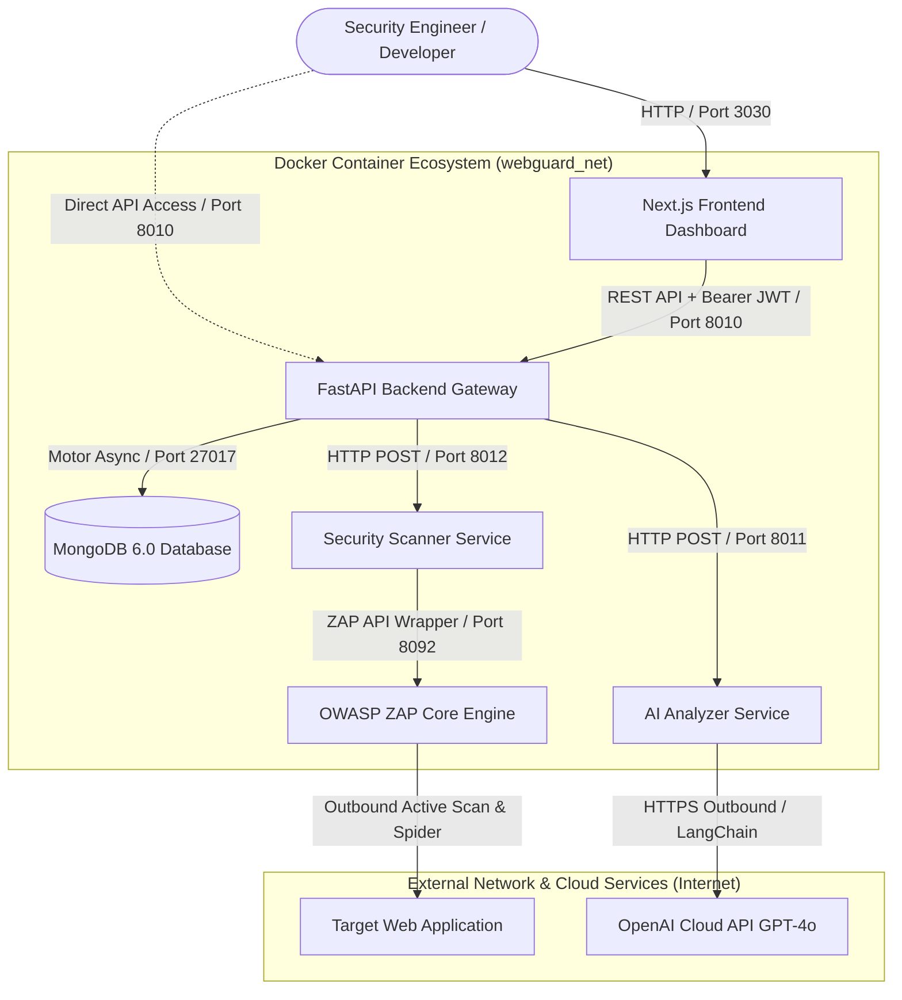

# 🛡️ WebGuard AI

### *Intelligent Dynamic Application Security Testing (DAST) Platform*

[](LICENSE)
[](https://www.python.org/)
[](https://fastapi.tiangolo.com/)
[](https://nextjs.org/)
[](https://www.docker.com/)
[](https://www.zaproxy.org/)
[](https://www.langchain.com/)
[](https://openai.com/)
[](https://www.mongodb.com/)

---

## 📌 Overview

**WebGuard AI** is a modern, enterprise-ready Dynamic Application Security Testing (DAST) platform that bridges the gap between raw automated vulnerability discovery and developer remediation.

Traditional security scanners flood engineering teams with complex, low-level technical reports packed with false positives, jargon, and generic advice. WebGuard AI introduces a **Dual-Engine Architecture**:

1. **Deterministic Security Engine (OWASP ZAP):** Executes rigorous, standardized crawling and active payload testing against web targets according to the **OWASP Top 10** vulnerabilities.
2. **Cognitive Analysis Layer (LangChain + OpenAI GPT-4o):** Triages raw alerts, validates findings against context, eliminates false positives, and generates ready-to-deploy remediation code patches in plain developer language.

The result is an automated, developer-first security posture assessment featuring an algorithmic **Security Score (0–100)**, risk heatmaps, and actionable fix guides.

---

## ✨ Key Features

<table>
  <tbody>
    <tr>
      <td valign="top" width="35">⚡</td>
      <td><strong>Automated DAST Discovery Pipeline:</strong> Crawls web targets with an automated Spider and initiates active payload scans via an isolated OWASP ZAP daemon.</td>
    </tr>
    <tr>
      <td valign="top" width="35">🧠</td>
      <td><strong>AI-Powered Alert Triaging:</strong> Evaluates discovered alerts to filter false positives and surface high-confidence vulnerabilities.</td>
    </tr>
    <tr>
      <td valign="top" width="35">🛠️</td>
      <td><strong>Actionable Code Remediation:</strong> Delivers tailored code solutions (Python, Node.js, PHP, React, etc.) and configuration hardening guides directly inside each vulnerability card.</td>
    </tr>
    <tr>
      <td valign="top" width="35">📊</td>
      <td><strong>Algorithmic Security Scoring:</strong> Calculates an objective security grade (<code>A+</code> to <code>F</code>) based on weighted risk impacts, displayed on an interactive visual gauge.</td>
    </tr>
    <tr>
      <td valign="top" width="35">🖨️</td>
      <td><strong>Executive Report Exporting (PDF & JSON):</strong> One-click high-fidelity PDF export featuring an automated print-optimized stylesheet, alongside machine-readable full JSON downloads for compliance and security audit trails.</td>
    </tr>
    <tr>
      <td valign="top" width="35">📜</td>
      <td><strong>Centralized Reports History (<code>/reports</code>):</strong> Comprehensive scan archive allowing security engineers to review past assessments, track vulnerability posture over time, and inspect or purge historical records.</td>
    </tr>
    <tr>
      <td valign="top" width="35">🔍</td>
      <td><strong>Deep-Linked Report Inspection:</strong> Direct route loading (<code>/?report_id=...</code>) to revisit and analyze any historical assessment in the full interactive Dashboard.</td>
    </tr>
    <tr>
      <td valign="top" width="35">🖥️</td>
      <td><strong>Modern Next.js Dashboard:</strong> Built with Next.js and Tailwind CSS, featuring live progress polling, risk charts, quick filtering, hot-reloading development support, and responsive dark-mode styling.</td>
    </tr>
    <tr>
      <td valign="top" width="35">⚙️</td>
      <td><strong>Configurable LLM Intelligence:</strong> Flexible AI engine supporting dynamic model switching (<code>gpt-4o</code>, <code>gpt-4o-mini</code>, etc.) via environment variables.</td>
    </tr>
    <tr>
      <td valign="top" width="35">🛡️</td>
      <td><strong>Multi-Tenant User Data Isolation:</strong> Enforces strict Broken Object Level Authorization (BOLA/IDOR) controls so security operators can only access, view, and delete their own vulnerability assessments.</td>
    </tr>
    <tr>
      <td valign="top" width="35">🔐</td>
      <td><strong>Secure Microservices Architecture:</strong> Zero shared state; all 6 services communicate via an internal Docker bridge network with JWT-secured REST APIs.</td>
    </tr>
  </tbody>
</table>

---

## 🏛️ System Architecture

WebGuard AI operates as a containerized microservices ecosystem managed by Docker Compose.



### 📦 Microservices Specifications

| Container Name | Service Role | Stack | Port | Description |
| :--- | :--- | :--- | :--- | :--- |
| `webguard-frontend` | **User Interface** | Next.js 14, React, Tailwind CSS | `3030` | Modern responsive web UI & interactive security dashboard |
| `webguard-backend` | **Central Gateway** | FastAPI, Python 3.11, Motor (Async) | `8010` | Authentication, pipeline orchestrator, scoring, & DB CRUD |
| `webguard-scanner-api` | **Scanner Bridge** | FastAPI, Python 3.11, `zapv2` | `8012` | Manages target validation, Spider crawls, and Active Scans |
| `webguard-zap-engine` | **Core DAST Engine** | OWASP ZAP Stable Daemon | `8092` | Automated web crawler and active security vulnerability scanner |
| `webguard-ai-api` | **Cognitive Analyzer**| FastAPI, LangChain, OpenAI API | `8011` | False-positive triaging, plain-language summaries, & code patches |
| `webguard-mongodb` | **Persistent Store** | MongoDB 6.0 | `27017` | Document store for user profiles, scans, and security reports |

---

## 🔄 End-to-End Scan Pipeline

```mermaid
sequenceDiagram
    autonumber
    actor User as Operator
    participant UI as Next.js Dashboard
    participant BE as FastAPI Gateway
    participant DB as MongoDB Store
    participant SC as Scanner Service
    participant ZAP as OWASP ZAP
    participant AI as AI Analyzer
    participant OAI as OpenAI (GPT-4o)

    User->>UI: Submit Target URL<br/>(e.g., https://target.com)
    UI->>BE: POST /api/scan { target_url }
    BE->>DB: Insert Scan Record<br/>(PENDING, user_id)
    BE-->>UI: 202 Accepted { scan_id }
    Note over BE: Launch Async Scan Pipeline

    Note over BE,ZAP: Stage 1: Automated Vulnerability Discovery
    BE->>SC: POST /api/scan { target_url }
    SC->>ZAP: Run Spider & Active Scan
    ZAP-->>SC: Raw Findings & Vulnerability Alerts
    SC-->>BE: Return Alerts Payload (JSON)

    Note over BE,OAI: Stage 2: AI Cognitive Triage & Code Fixes
    BE->>AI: POST /api/analyze { alerts }
    AI->>OAI: Triage, Deduplication<br/>& Remediation Prompt
    OAI-->>AI: Enriched Analysis & Code Patches
    AI-->>BE: Return Validated Security Analysis

    Note over BE,DB: Stage 3: Scoring & Tenant Persistence
    BE->>BE: Compute Algorithmic Score<br/>& Grade (0–100)
    BE->>DB: Save Final Report (scoped to user_id)<br/>& Update Status: COMPLETED

    loop Polling Every 3s
        UI->>BE: GET /api/scan/{scan_id}
        BE-->>UI: Return Status & Progress
    end

    Note over UI,BE: Pipeline Completed
    UI->>BE: GET /api/reports/{scan_id}
    BE->>DB: Query User Report (user_id)
    DB-->>BE: Return Report Document
    BE-->>UI: Return Full Report Payload
    UI-->>User: Render Interactive Dashboard<br/>(Ready for PDF / JSON Export)
```



---

## 🧮 Security Scoring Methodology

WebGuard AI assesses the target application's security posture using a deterministic algorithmic scoring model:

$$Score = \max\left(0, 100 - \sum (\text{Vulnerability Count} \times \text{Weight})\right)$$

### ⚖️ Risk Penalty Weights

| Vulnerability Severity | Impact Weight | Rationale |
| :--- | :---: | :--- |
| **High** | `-15 pts` | Critical risks (e.g., SQLi, RCE, Broken Auth) that can lead to total compromise. |
| **Medium** | `-8 pts` | Significant flaws (e.g., Stored XSS, CSRF, sensitive header disclosure). |
| **Low** | `-3 pts` | Configuration weaknesses, missing clickjacking protections, or info leaks. |
| **Informational** | `-1 pt` | Low-impact observations, timestamp disclosures, or header suggestions. |

### 📊 Posture Grade Scale

| Score Range | Grade | Posture Badge | Definition |
| :---: | :---: | :---: | :--- |
| **95 – 100** | `A+` | 🟢 Excellent | Fully hardened application; no significant vulnerabilities detected. |
| **85 – 94** | `A` | 🟢 Very Good | Robust posture with only minor informational findings. |
| **70 – 84** | `B` | 🟡 Good | Acceptable posture; requires moderate hardening. |
| **50 – 69** | `C` | 🟠 Average | Elevated risk; vulnerabilities must be scheduled for remediation. |
| **30 – 49** | `D` | 🔴 Poor | High-risk posture with multiple severe vulnerabilities. |
| **0 – 29** | `F` | 🚨 Critical | Severe compromise risk; requires immediate incident intervention. |

---

## 📄 Reporting, Exporting & Audit History

WebGuard AI provides enterprise-grade reporting workflows to bridge security engineering with executive and compliance teams:

<table>
  <tbody>
    <tr>
      <td valign="top" width="35">🖨️</td>
      <td><strong>One-Click PDF Export:</strong> Directly from the scan dashboard, click <strong>"Export PDF"</strong> to generate a clean, print-ready document. The custom <code>@media print</code> CSS engine automatically converts the dark UI into an executive, high-contrast white layout while omitting interactive buttons and preserving security gauges, charts, and remediation directives.</td>
    </tr>
    <tr>
      <td valign="top" width="35">💾</td>
      <td><strong>Machine-Readable JSON Downloads:</strong> Export full vulnerability payloads—including verified findings, false-positive metrics, severity ratings, and AI-generated remediation patches—for automated ingestion into SIEMs, defect trackers (Jira/GitHub), or compliance archives.</td>
    </tr>
    <tr>
      <td valign="top" width="35">📜</td>
      <td><strong>Centralized Reports Hub (<code>/reports</code>):</strong> A dedicated interface to review, search, deep-link, and purge historical assessments stored in MongoDB.</td>
    </tr>
    <tr>
      <td valign="top" width="35">🔍</td>
      <td><strong>Instant Historical Inspection:</strong> Re-open any past scan into the live dashboard with a single click (<code>👁️ View</code>) or via direct URL parameter (<code>/?report_id=...</code>).</td>
    </tr>
  </tbody>
</table>

---

## 🛠️ Tech Stack

- **Frontend:** Next.js (Pages Router & Turbopack), React 19, Tailwind CSS, Recharts.
- **Backend Services:** FastAPI, Python 3.11, Pydantic v2, Motor (Async MongoDB), PyJWT, Passlib (bcrypt).
- **Scanner Engine:** OWASP ZAP (Zed Attack Proxy) 2.14+, `zapv2` Python Client.
- **AI & Intelligence:** LangChain, OpenAI API (configurable via `OPENAI_MODEL`, supporting `gpt-4o` / `gpt-4o-mini`), Structured JSON Outputs.
- **Persistence & DevOps:** MongoDB 6.0, Docker, Docker Compose (with Volume hot-reloading for frontend), Linux / WSL2.

---

## ⚙️ Prerequisites

Before getting started, ensure your environment meets the following requirements:

- **Operating System:** Linux, macOS, or Windows 11 with **WSL2** (Ubuntu 22.04 LTS recommended).
- **Docker & Docker Compose:** Docker Engine 24.0+ and Docker Compose v2.20+.
- **OpenAI API Key:** An active key from [platform.openai.com](https://platform.openai.com/api-keys).
- **Hardware Recommendation:** 4 CPU cores, 8 GB RAM (OWASP ZAP requires sufficient memory for Java heap allocation).

---

## 🚀 Quickstart & Installation

### 1. Clone the Repository

```bash
git clone https://github.com/Ammar-1993/WebGuard-AI.git
cd WebGuard-AI
```

### 2. Configure Environment Variables

Create your environment configuration from the provided template:

```bash
cp .env.example .env
```

Open `.env` and fill in your credentials:

```env
# OpenAI API Key (Required for AI Analysis)
OPENAI_API_KEY=sk-proj-your-openai-api-key-here

# Preferred OpenAI Model (Default: gpt-4o | Optional: gpt-4o-mini, gpt-4-turbo)
OPENAI_MODEL=gpt-4o

# Secret Key for JWT Token Generation
JWT_SECRET=your-secure-random-jwt-secret-key
```

### 3. Build and Start Microservices

Launch the entire ecosystem in detached mode:

```bash
docker compose up --build -d
```

Verify all 6 containers are running and healthy:

```bash
docker compose ps
```

Expected output:
```text
NAME                   IMAGE                      STATUS                 PORTS
webguard-mongodb       mongo:6.0.10               Up (healthy)           0.0.0.0:27017->27017/tcp
webguard-zap-engine    zaproxy/zap-stable:latest  Up (healthy)           0.0.0.0:8092->8092/tcp
webguard-scanner-api   webguard-scanner-api       Up                     0.0.0.0:8012->8012/tcp
webguard-ai-api        webguard-ai-analyzer       Up                     0.0.0.0:8011->8011/tcp
webguard-backend       webguard-backend-api       Up                     0.0.0.0:8010->8010/tcp
webguard-frontend      webguard-frontend          Up                     0.0.0.0:3030->3030/tcp
```

### 4. Access the Application

| Portal | URL | Description |
| :--- | :--- | :--- |
| **Web Dashboard** | [http://localhost:3030](http://localhost:3030) | Main scan execution and interactive assessment view |
| **Reports History** | [http://localhost:3030/reports](http://localhost:3030/reports) | Historical scan audit trail, JSON exports, and report management |
| **Backend API Docs** | [http://localhost:8010/docs](http://localhost:8010/docs) | Interactive Swagger UI for core backend gateway |
| **AI Service Docs** | [http://localhost:8011/docs](http://localhost:8011/docs) | AI Analyzer OpenAPI documentation |
| **Scanner Service Docs** | [http://localhost:8012/docs](http://localhost:8012/docs) | Scanner OpenAPI documentation |

---

## 📡 REST API Reference

The Backend Gateway provides secure, token-authenticated RESTful endpoints:

### 🔐 Authentication (`/api/auth`)
| Method | Endpoint | Description | Access Level |
| :---: | :--- | :--- | :---: |
| `POST` | `/api/auth/register` | Register a new security operator account | `🌐 Public` |
| `POST` | `/api/auth/login` | Authenticate credentials and receive JWT bearer token | `🌐 Public` |
| `GET` | `/api/auth/me` | Fetch active authenticated profile details | `🔒 Protected` |

### 🎯 Security Scans (`/api/scan`)
| Method | Endpoint | Description | Access Level |
| :---: | :--- | :--- | :---: |
| `POST` | `/api/scan` | Trigger a new asynchronous DAST scan pipeline | `🔒 Protected` |
| `GET` | `/api/scan/{scan_id}` | Poll real-time scan progress, status & findings | `🔒 Protected` |

### 📑 Security Reports (`/api/reports`)
| Method | Endpoint | Description | Access Level |
| :---: | :--- | :--- | :---: |
| `GET` | `/api/reports` | List all historical reports for active user (sorted descending) | `🔒 Protected` |
| `GET` | `/api/reports/{report_id}` | Fetch granular report details & AI remediation patches | `🔒 Protected` |
| `DELETE` | `/api/reports/{report_id}` | Remove a report and associated scan artifacts | `🔒 Protected` |

> 💡 **User Data Isolation:** All protected scan and report endpoints enforce strict Broken Object Level Authorization (BOLA/IDOR protection). Operators only have access to records linked to their authenticated `user_id`.

---

## 🧪 Safe Targets for Testing & Benchmarking

When testing WebGuard AI in non-production environments, use authorized vulnerable test applications:

- **OWASP Juice Shop:** `http://localhost:3000` (Modern vulnerable JavaScript application)
- **Zero Bank Demo:** `http://zero.webappsecurity.com` (Safe banking test target)
- **Google Gruyere:** `https://google-gruyere.appspot.com` (Web application vulnerabilities lab)
- **Altoro Mutual:** `http://demo.testfire.net` (Simulated corporate banking portal)

> ⚠️ **Authorization Disclaimer:** Only scan applications and infrastructure that you own or have received explicit, written permission to assess. Unauthorized vulnerability scanning may violate legal regulations and terms of service.

---

## 🧯 Troubleshooting & Common Questions

<details>
<summary><strong>1. OWASP ZAP takes longer than expected or times out</strong></summary>

Large web applications with hundreds of routes can take several minutes to spider. By default, `scanner_engine.py` sets a 300-second safeguard timeout on the Active Scan phase. You can adjust this threshold in `security-scanner/scanner_engine.py`.
</details>

<details>
<summary><strong>2. AI Analyzer returns an OpenAI authentication error</strong></summary>

Ensure your `OPENAI_API_KEY` is set correctly in `.env` and has active quota/billing credits. Check container logs using:
```bash
docker compose logs -f ai-analyzer
```
</details>

<details>
<summary><strong>3. Port conflict (e.g., port 3030, 8010, or 27017 already in use)</strong></summary>

If host ports conflict with existing services, modify the left-hand host port mapping in `docker-compose.yml` (e.g., change `"3030:3030"` to `"3031:3030"`).
</details>

<details>
<summary><strong>4. How to view aggregated real-time logs</strong></summary>

Stream live logs across all services:
```bash
docker compose logs -f
```
Or for a single service:
```bash
docker compose logs -f backend-api
```
</details>

---

## 🔒 Security Best Practices Implemented

- **Principle of Least Privilege:** Services run as isolated containers with non-root configurations where applicable.
- **Defense in Depth:** The raw vulnerability engine operates independently from the AI decision model; AI cannot alter discovery findings, only enrich analysis.
- **Zero Hardcoded Secrets:** Sensitive keys (`JWT_SECRET`, `OPENAI_API_KEY`) are dynamically injected via environment variables.
- **Cryptographic Protection:** User credentials utilize salted bcrypt hashing with standard JWT expiry intervals.
- **Object-Level Authorization (BOLA / IDOR Prevention):** In compliance with OWASP API Security Top 10 (`API1:2023`), all report queries and mutation endpoints enforce strict ownership validation against the authenticated `user_id`.

---

## 📄 License

This project is licensed under the **MIT License** — see the [LICENSE](LICENSE) file for details.

---

## 👤 Author

<div align="center">
  <p>Developed with ❤️ by <b>Eng. Ammar Al-Najjar (م. عمار النجار)</b></p>
  <p>
    <a href="https://github.com/Ammar-1993"></a>
    <a href="mailto:ammaralnggar@gmail.com"></a>
  </p>
</div>